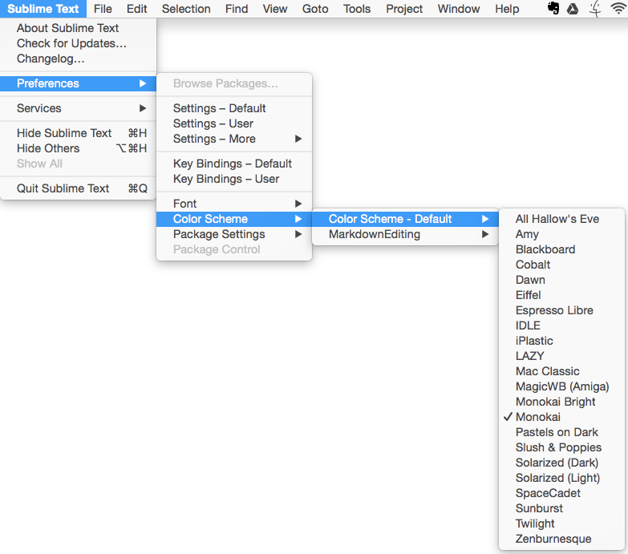
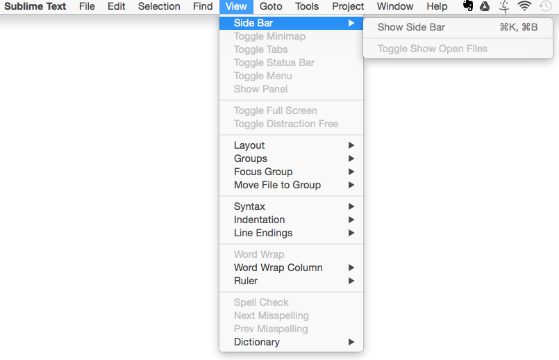
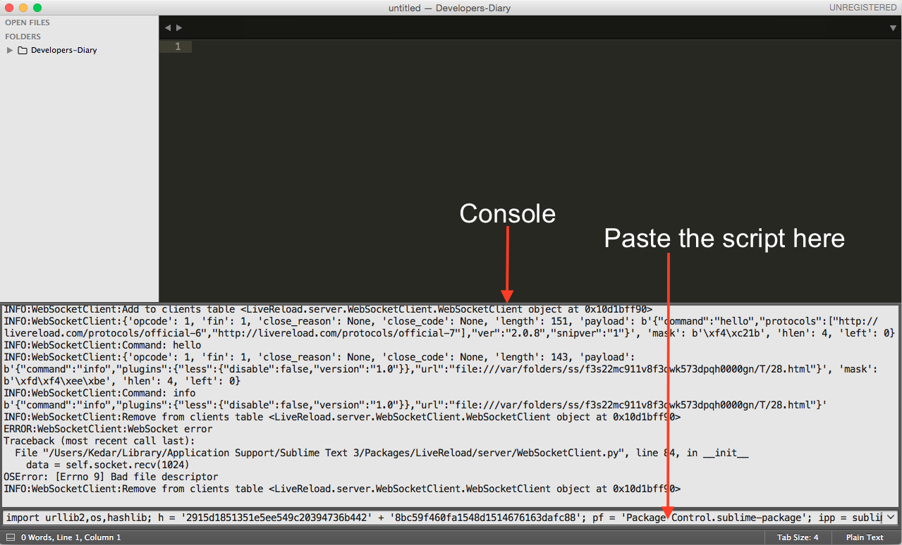
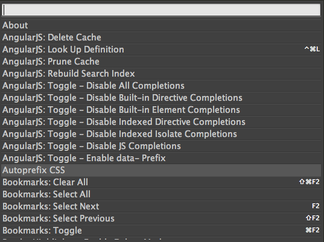
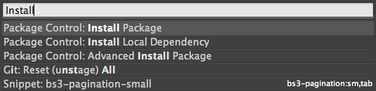
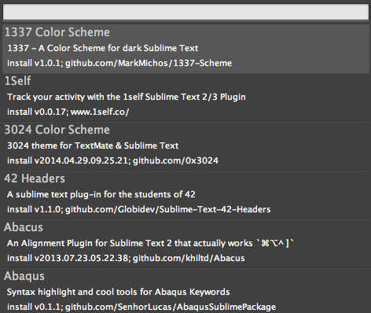
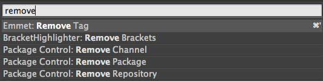
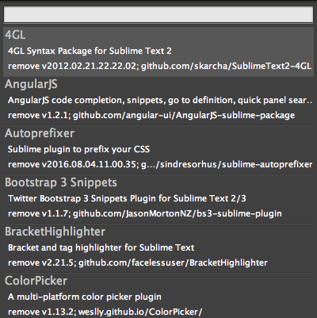

[Table to contents](README.md) | [Next Chapter](Ch2.md)

---

# Sublime Text Editor Bare Bones
## Chapter 1 : Setting Up Sublime Text Editor
Once Sublime text is installed some basic setting would make your live easy. Also one needs to install the package controller which would help install the powerfull packages that like auto competion of syntax for languages, Zen coding etc.

#### Topics
1. [Changing color themes](#changing-color-themes)
2. [Show Side bar to show folders and files](#show-side-bar-to-show-folders-and-files)
3. [Installing package controller](#installing-packages-controller)
4. [Installing packages using Package controller](#installing-packages-using-package-controller)
5. [Uninstalling packages using Package controller](#uninstalling-packages-using-package-controller)

#### Changing color themes
You can change the colour theme by going to menus: Preferences > Color Scheme > Color Scheme - Default  and select the desired color theme.

#### Show Side bar to show folders and files
You can open the side bar by going to menus: View > Side Bar > Show Side Bar.
Now can drag and drop the project folder on the side bar to get a tree view of all the project files and open them by clicking the open you want to open.

#### Installing packages controller
To start installing packages you first need to install the **package controller**.

1. Open the console from menus: View > Show Console
2. Paste the Python script from <a href="https://packagecontrol.io/installation" target="_blank">https://packagecontrol.io/installation</a> - Simple installation.

3. Press enter
4. Once the script is run successfully Restart the sublime editor.

#### Installing packages using Package controller

1. Press <kbd>Control</kbd> + <kbd>Shift</kbd> + <kbd>p</kbd> (Mac : <kbd>Command</kbd> + <kbd>Shift</kbd> + <kbd>p</kbd>) a panel would appear on the screen

2. Type "install" ... Package Control : Install Package should show up in the below drop down.

Select the option and click enter

3. After a few seconds another panel would show up on the screen

4. Start typing the package name or the keyword you want to install the list would get filtered by the pacakge name/ keyword
5. Select the package you want to install and press enter

#### Uninstalling packages using Package controller
1. Press <kbd>Control</kbd> + <kbd>Shift</kbd> + <kbd>p</kbd> (Mac : <kbd>Command</kbd> + <kbd>Shift</kbd> + <kbd>p</kbd>) a panel would appear on the screen

2. Type "remove" ...Select "Package Control : Remove Package" from the below drop down and press enter.

3. A list of all the installed packages would be shown, select the package to uninstall and click enter 

---

[Table to contents](README.md) | [Next Chapter](Ch2.md)