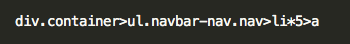
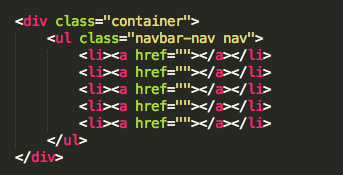
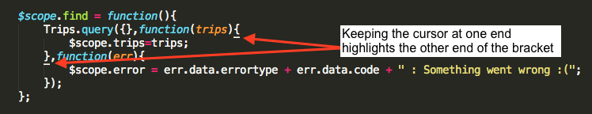
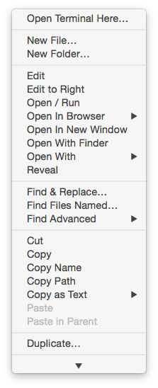
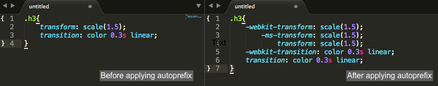

[Table to contents](README.md) | [Previous Chapter](Ch1.md) . [Next Chapter](Ch3.md)

---
# Sublime Text Editor Bare Bones
## Chapter 2 : Sublime packages a developer should have
Sublime text has a long list of packages which can be found [here](https://packagecontrol.io/browse). You will find packages from language syntax to folder and git management.

As a front end developer I would sugget a few packages that would definetly make your lifes a litte easy.

#### Topics
1. [Emmet](#emmet)
2. [BracketHighlighter](#brackethighlighter)
3. [SideBarEnhancements](#sidebarenhancements)
4. [Terminal](#terminal)
5. [HTML5](#html5)
6. [Autoprefix CSS](#autoprefix-css)
7. [Angular JS](#angular-js)

### Emmet
This tool helps in high speed HTML coding. The most manual effort in HTML coding goes mainly in putting in the starting ending tags for each element. This tool helps you in reducing this typing.
With Emmet you go from this:
 

to this:

 

### BracketHighlighter
This is a simple package which helps highlight the ending or starting of the brackets in your code. 

### SideBarEnhancements
This package will allow you to create, move folder, move files between folder from editor. After you install and restart you should be able to see a list of new options added when you right click on the side panel.

### Terminal
Open a Terminal in the directory your current file belongs to. By default you just press the short cut key <kbd>Ctrl</kbd> + <kbd>Shit</kbd> + <kbd>t</kbd> (Mac: <kbd>Command</kbd> +  <kbd>Shit</kbd> + <kbd>t</kbd>)  

### HTML5
Auto completes HTML5 tags like section, article 

### Autoprefix CSS
Autoprefix CSS helps you prefix the CSS file with correct browser vendor prefix for CSS properties using <http://caniuse.com/> data. By default it is set to `"browsers": ["last 2 versions"]` which can be changed by going to menus: Preferences > Package Settings > Autoprefix > Settings - User and add the lines 
`{"browsers": ["last 7 versions"]}` or how many browsers back you want to check. 

To use just open the CSS file and press <kbd>Ctrl</kbd> + <kbd>Shit</kbd> + <kbd>p</kbd> (Mac: <kbd>Command</kbd> +  <kbd>Shit</kbd>+ <kbd>p</kbd>)  and Autoprefix CSS.

 

### Angular JS
If you work on Angular JS this package helps auto completes Angular JS attributes starting with ng-*. Also you can auto complete modules,factories,service,directives etc.

---

[Table to contents](README.md) | [Previous Chapter](Ch1.md) . [Next Chapter](Ch3.md)