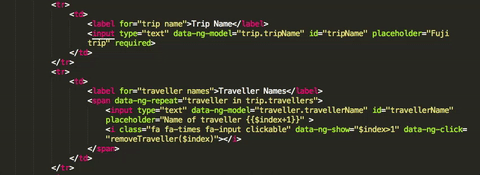
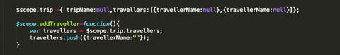
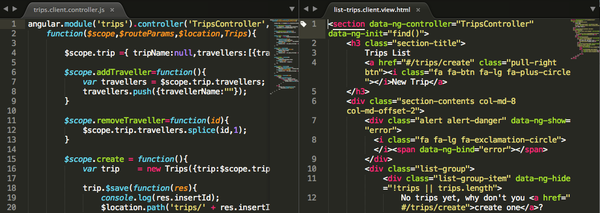
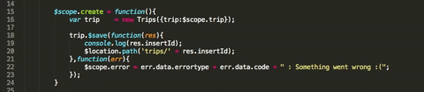
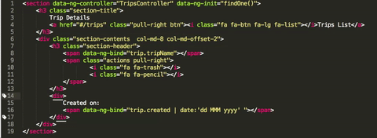
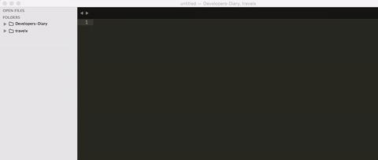

[Table to contents](README.md) | [Previous Chapter](Ch2.md)

---
# Sublime Text Editor Bare Bones
## Chapter 3 : Shortcuts

#### Topics
1. [Quick comment the code](quick-comment-the-code)
2. [Multi-Text Selection (Quick Find Replace)](multi-text-selection-quick-find-replace)
3. [Select current line](select-current-line)
4. [Split screen into multiple panes](split-screen-into-multiple-panes)
5. [Jump between end or start of brackets](jump-between-end-or-start-of-brackets)
6. [Move lines up and down](move-lines-up-and-down)
7. [Go to any file](go-to-any-file)
8. [Duplicate current line](duplicate-current-line)

#### Quick comment the code
* <kbd>Ctrl</kbd> + <kbd>/</kbd> (Windows)
* <kbd>Command</kbd> + <kbd>/</kbd> (Mac)

Highlight the section of code to comment and use the shortcut.

#### Multi-Text Selection (Quick Find Replace)
* <kbd>Alt</kbd> + <kbd>F3</kbd> (Windows)
* <kbd>Ctrl</kbd> + <kbd>Command</kbd> + <kbd>g</kbd> (Mac)
This is one of my favoratie one. Quick find and replace, all you need to do is select the word you want to replace and press the shortcut, the editor will highlight all the occurences of the selected text. You can move the cursor on the selected text and change to the new text and press enter.

If you want to select only a few instance of the selected text you can use:
* <kbd>Ctrl</kbd> + <kbd>d</kbd> (Windows)
* <kbd>Command</kbd> + <kbd>d</kbd> (Mac)

Every time you hit the shortcut the next instance of the word is selected.

#### Select current line
* <kbd>Ctrl</kbd> + <kbd>L</kbd> (Windows)
* <kbd>Command</kbd> + <kbd>L</kbd> (Mac)

#### Split screen into multiple panes
* <kbd>Alt</kbd> + <kbd>Shift</kbd> + <kbd>2</kbd> / <kbd>1</kbd> (Windows)
* <kbd>option</kbd> + <kbd>Command</kbd> + <kbd>2</kbd> / <kbd>1</kbd> (Mac)

The shortcut helps split the editor screen into two panels within which different files can be opened. This is usefull to see two code side by side.

 
#### Jump between end or start of brackets
* <kbd>Ctrl</kbd> + <kbd>M</kbd> (Windows)
* <kbd>Ctrl</kbd> + <kbd>M</kbd> (Mac)

This shortcut help you jump between end or start of brackets for a given code.

#### Move lines up and down
* <kbd>Ctrl</kbd> + <kbd>Shift</kbd> + <kbd>up</kbd> / <kbd>Down</kbd> arrow (Windows)
* <kbd>Ctrl</kbd> + <kbd>Command</kbd> + <kbd>up</kbd> / <kbd>Down</kbd> arrow (Mac)

Select a paragraph or line and move it up or down using this shortcut. This is usefull for code rearrangement.

#### Go to any file
* <kbd>Ctrl</kbd> + <kbd>p</kbd> (Windows)
* <kbd>Command</kbd> + <kbd>p</kbd> (Mac)

A popup will appear. When you start typing in the popup would will see all the file names that contain the text entered from the opened project.

#### Duplicate current line
* <kbd>Ctrl</kbd> + <kbd>Shift</kbd> + <kbd>d</kbd> (Windows)
* <kbd>Command</kbd> + <kbd>Shift</kbd> + <kbd>d</kbd> (Mac)

This create a copy of the complete line currently the cursor is on and insert it below the current line.

---

[Table to contents](README.md) | [Previous Chapter](Ch2.md)